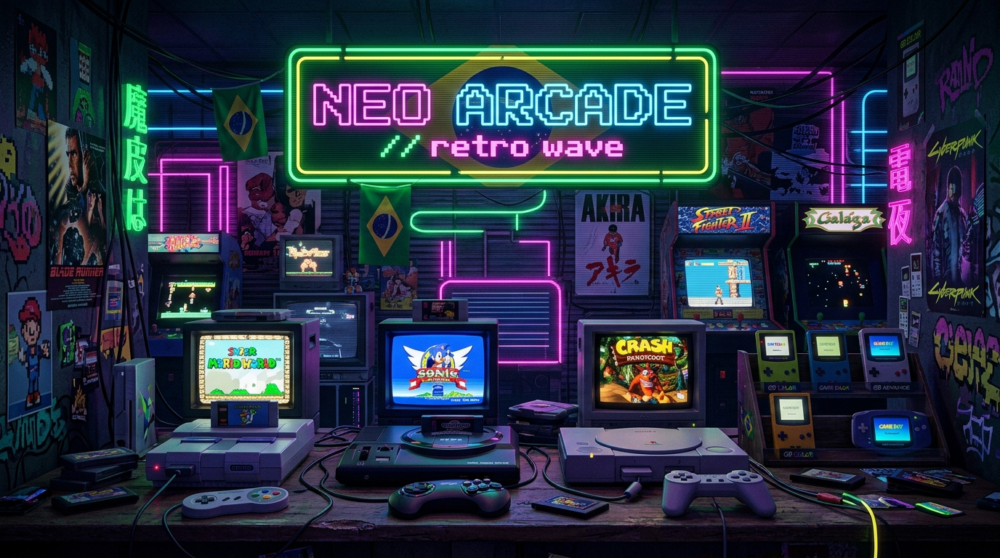

# 🎮 PixelArquivo — Catálogo Brasileiro de ROMs Retro (PT-BR)

**PixelArquivo** é uma aplicação web moderna, fluida e interativa dedicada à preservação, catalogação e execução de ROMs retro traduzidas, acentuadas e dubladas em **Português do Brasil (PT-BR)**.



---

## 🌟 Funcionalidades Principais

- 🎮 **Preservação de ROMs PT-BR**: Fichas técnicas completas para jogos de **SNES**, **PlayStation 1**, **Mega Drive**, **Game Boy Advance (GBA)** e **Nintendo 64**.
- 🔍 **Busca & Filtros em Tempo Real**:
  - Filtro por Console (Super Nintendo, PS1, GBA, Mega Drive, N64).
  - Filtro por Gênero (RPG, Metroidvania, Plataforma, Survival Horror, Luta, Corrida).
  - Filtro por Recurso (Dublado em PT-BR 🎙️, Com Acentuação ✍️, Destaques ⭐).
  - Ordenação por Mais Baixados, Melhor Avaliados, Nome (A-Z) e Ano.
- 🔊 **Áudio Synthesizer Chiptune 8-Bit**: Efeitos sonoros sintetizados via Web Audio API para cliques, favoritos e abertura de modais.
- 📺 **Modo TV CRT (Scanlines)**: Efeito retrô ativável de linhas de varredura CRT.
- 🕹️ **Emulador Web Integrado**: Janela de execução online com suporte a Save State, Pause e controles mapeados no teclado.
- ❤️ **Gerenciador de Favoritos**: Salva seus jogos preferidos no `localStorage` com opção de exportar a lista em `.json`.
- ➕ **Modal de Contribuição**: Formulário para envio de novas ROMs e patches pela comunidade.

---

## 🛠️ Tecnologias Utilizadas

- **Core**: [React 19](https://react.dev/) + [Vite](https://vitejs.dev/)
- **Estilização**: CSS Vanilla com Variáveis CSS, Dark Glassmorphism & Neon Retro UI
- **Tipografia**: Google Fonts (*Press Start 2P*, *Outfit*, *Rajdhani*)
- **Ícones**: [Lucide React](https://lucide.dev/)
- **Efeitos**: [Canvas Confetti](https://www.npmjs.com/package/canvas-confetti)
- **Áudio**: Web Audio API (Synthesizer Chiptune 8-Bit)

---

## 🚀 Como Executar o Projeto Localmente

### Pré-requisitos
- Node.js `v18+` instalado
- NPM `v9+` instalado

### Passo a Passo

1. **Clonar o Repositório**:
   ```bash
   git clone https://github.com/JoaoSantosCodes/PIXELARQUIVO-PT-BR.git
   cd PIXELARQUIVO-PT-BR
   ```

2. **Instalar as Dependências**:
   ```bash
   npm install
   ```

3. **Iniciar o Servidor de Desenvolvimento**:
   ```bash
   npm run dev
   ```
   Acesse a aplicação em `http://localhost:5173`.

4. **Gerar o Build de Produção**:
   ```bash
   npm run build
   ```

---

## 📜 Créditos aos Tradutores e Romhackers

Agradecimentos especiais a todos os grupos históricos de romhacking do Brasil:
- *Monkey's Traduções*
- *PO.BOX*
- *Trans-Center*
- *Romhackers BR*
- *Tectoy*
- *Sonic PTBR*
- E todos os autores e comunidades independentes.

---

## 📄 Licença

Este projeto é disponibilizado sob a licença MIT. Criado para fins educativos e de preservação da cultura de retrogaming brasileira.
